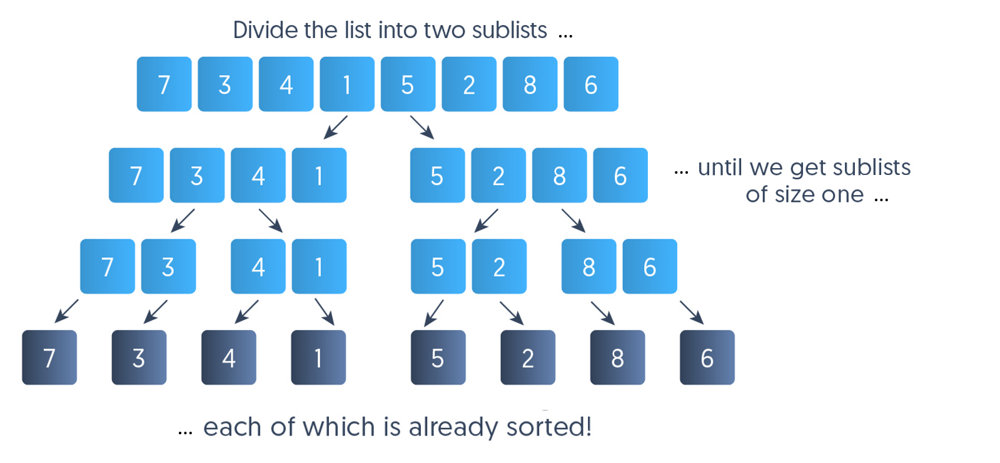
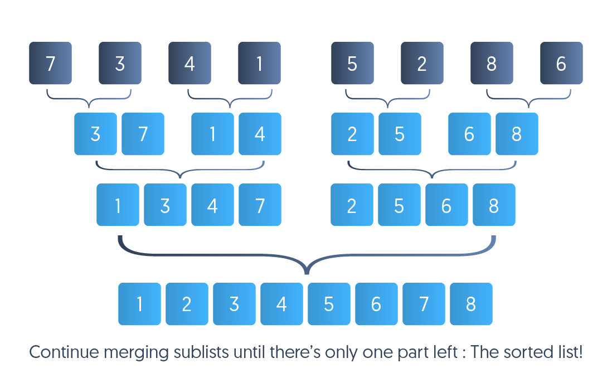
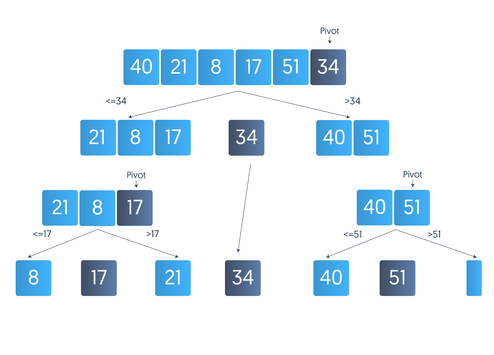
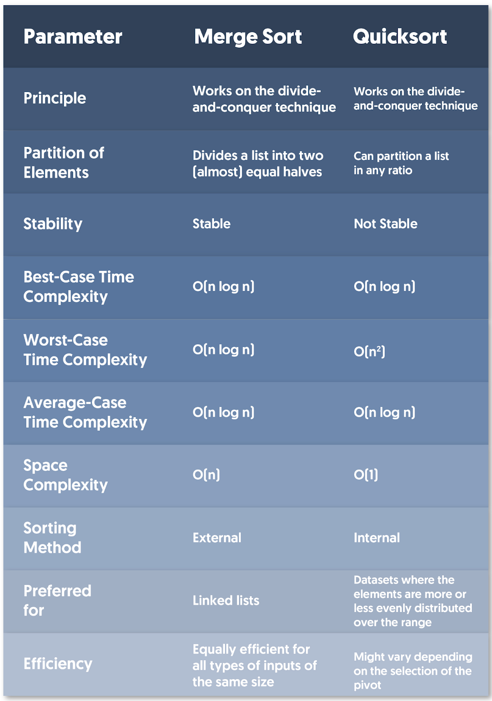
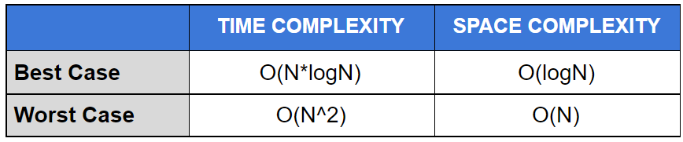

# google-initial-phone-screen-interview-questions
Google Initial Phone Screen Interview Questions

**Google Interview Questions**

**1. Merge Sort**

Merge sort is a comparison-based sorting algorithm that employs the divide-and-conquer strategy. In the divide-and-conquer approach, the problem is divided into multiple subproblems, solved individually, and finally, the result of the subproblems are combined to form the final solution.

In merge sort, we divide the array into two smaller subarrays of equal size or with a size difference of one, depending on the parity of the array’s length. Each subarray is further divided into two smaller subarrays again and again recursively until we get subarrays of size one. We then sort the subarrays and merge them to produce the sorted array.

 

**2. Quicksort**

Quicksort is a comparison-based sorting algorithm. Like merge sort, this is also based on the divide-and-conquer strategy. The algorithm has two basic operations —  swapping items in place and partitioning a section of the array.

Quicksort sorts an array by choosing a pivot element and then partitioning the rest of the elements around the pivot. All the elements less than the pivot are moved to the left side of the pivot (called left partition), and the elements greater than or equal to the pivot are moved to the right of the pivot (called right partition).

The sorting is continued on left and right partitions separately and recursively by choosing pivot points and breaking down the partitions into single-element subarrays before combining them to form one sorted list.

 

**3. Key Differences Between Quicksort and Merge Sort**

**Functionality**

Although both merge sort and quicksort work on the same divide-and-conquer principle, they handle the partition and sorting very differently. 

Merge sort partitions a list into two sublists of equal sizes (different in size by 1, when the size of the list is odd) and merges the sorted sublists optimally to form a sorted list. In contrast, quicksort doesn’t necessarily partition the list into sublists of equal size. The partition sizes may be of any size, depending on how we choose the pivot.

We can also observe that merge sort performs all the sorting during the process of merging while quicksort performs most of the sorting in the process of dividing.

**Sorting Method**

Merge sort is an external sorting method in which the data that is to be sorted can be stored outside the memory and is loaded in small chunks into the memory for sorting.

Quicksort is an internal sorting method, where the data that is to be sorted needs to be stored in the main memory throughout the sorting process.

**Application**

Merge sort is very efficient for sorting linked lists since linked lists cannot be randomly accessed, and in merge sort, we don’t require random access, while in quicksort, we need to randomly access elements.

Quicksort is very efficient for sorting small datasets. It is also the preferred sorting algorithm when allocating additional memory is costly since it is an in-place sorting algorithm while merge sort has a space complexity of O(n).

**Worst-Case Complexity**

Merge sort performs the same number of comparison and assignment operations for an array of a particular size. Therefore, its worst-case time complexity is the same as best-case and average-case time complexity, that is, O(n log n).

In quicksort, as we’ve already discussed, the choice of the pivot plays an important role. Let’s suppose we always choose the rightmost element of a list to be the pivot and the input array is reverse-sorted. The partitions created will be highly unbalanced (of sizes 0 and (n - 1) for a list of size n); that is, the sizes of the partitions differ a lot. This results in the worst-case time complexity of O(n2).

**What They Work Well On**

Merge sort operates well on any type of dataset, whether it is large or small.

Quicksort generally is more efficient for small datasets or on those datasets where the elements are more-or-less evenly distributed over the range.

**Speed**

Merge sort generally performs fewer comparisons than quicksort both in the worst-case and on average. If performing a comparison is costly, merge sort will have the upper hand in terms of speed.

Quicksort is generally believed to be faster in common real-life settings. This is mainly due to its lower memory consumption which usually affects time performance as well.

**Space Requirement**

Merge sort requires the creation of two subarrays in addition to the original array. This is necessary for the recursive calls to work correctly. Consequently, the algorithm must create n elements in memory. Thus, the space complexity is O(n). 
Merge-sort can be made in place, but all such algorithms have a higher time complexity than O(n log n).

Quicksort is an in-place sorting algorithm. Its memory complexity is O(1).

**Stability**

Merge sort is a stable sorting algorithm, i.e., it maintains the relative order of two equal elements.

Quicksort is an unstable sorting algorithm, i.e., it might change the relative order of two equal elements.

**Efficiency**

The characteristics of the list don’t affect the speed of merge sort. If we assume the time cost of comparison and assignment to be constant, merge sort always takes the same time for a particular size of an array. Thus, it is consistent and efficient on any kind of dataset.

The efficiency of quicksort largely depends on how we choose the pivot. If the partitions created are very unbalanced, quicksort becomes very slow and inefficient. However, in general, quicksort is very efficient for small datasets.

 

 

**4: Which is a better sorting algorithm — merge sort or quicksort?**

There’s no definite answer to this question. It really depends on the kind of data we want to sort and what kind of sorting we expect. Both the algorithms have their advantages and disadvantages.

Let’s just go through some scenarios for better understanding:

If we want the relative order of equal elements after sorting the data to be preserved, merge sort would be the preferred choice since merge sort is a stable sorting algorithm while quicksort isn’t. Although quicksort can be modified to be stable, it is hard to implement and reduces the algorithm’s efficiency.

If the cost of allocating new memory is very high, we should always prefer quicksort since it is an in-place sorting algorithm while merge sort requires additional memory. 

Although merge sort can be modified to work in-place, its efficiency would be reduced.
If the dataset to be sorted is too big to fit in the memory all at once, using quicksort wouldn’t be possible since it is an internal sorting algorithm and requires random access to the whole dataset during the process of sorting. Merge sort, being an external sorting algorithm, would serve the purpose in this case.

 

**5: Why is merge sort preferred over quicksort for sorting linked lists?**

Quicksort highly depends on randomly accessing the data elements and swap elements in the dataset. Since the memory allocation of linked lists is not necessarily continuous, we can not randomly access elements of a linked list efficiently. This also makes swapping very expensive in linked lists. Merge sort is faster in this situation because it reads the data sequentially. Data insertion in any part of the linked list is also very efficient if we are given the reference to the previous node so that the merge operation can be implemented in-place. Thus, merge sort becomes an ideal sorting algorithm for linked lists.

 

**6.Merge sort, advantages and disadvantages**

**Advantages**

* It is quicker for larger lists because unlike insertion and bubble sort it doesnt go through the whole list seveal times.

* It has a consistent running time, carries out different bits with similar  times in a stage.

**Disadvantages**

* Slower comparative to the other sort algorithms for smaller tasks.

* Goes through the whole process even i he list is sorted (just like insertion and bubble sort?)

* Uses more memory space to store the sub elements of the initial split list.

 

**7. When Does the Worst Case of Quicksort Occur?**

Quicksort works by dividing an array into smaller arrays and then sorting those smaller arrays. A pivot element is used to partition an array into smaller arrays; smaller arrays are divided recursively until an array with only one or no elements is created. Hence, the selection of the pivot element plays an important role in the efficiency of the quicksort algorithm.

But when the pivot element divides the array into two unbalanced sub-arrays (huge difference in size), the performance of quicksort decreases. Following are the cases where the pivot divides an array into two unbalanced sub-arrays: 

* **When the input array is already sorted**, and we choose the leftmost element as the pivot element. In this case, we’ll have two extremely unbalanced arrays. One array will have 0 elements, and the other one will have N - 1 elements.
* **When the given array is reverse sorted**, and we choose the rightmost element as the pivot element. Again, in this case, the pivot elements will split the input array into two unbalanced arrays of size 0 and N - 1.
* **When all the elements in the given array are the same**. In such a scenario, the pivot element divides the array into one subarray of length N-1, and the time complexity of Quicksort increases significantly.

 

**8. Can quicksort be implemented in O(NLogN) worst-case time complexity?**

Yes, we can minimize the worst-case time complexity of quicksort to O(N*logN) by finding the median of the unsorted array in O(N) and using the median as the pivot. By doing this, we make sure that the array is divided into two subarrays of almost equal size, and we never encounter the case when the array is divided into subarrays of size 0 and N-1. But the constant factor of this method is very high, and therefore, it is not used in practice.

 

**9. Despite having a worst-case time complexity of O(N^2), why is quicksort considered a fast sorting algorithm?**

The worst case of quicksort O(N^2) can be easily avoided with a high probability by choosing the right pivot. Obtaining an average-case behavior by choosing the right pivot element makes the performance better and as efficient as merge sort. Quicksort, in particular, exhibits good cache locality, which makes it faster than merge sort in many cases, such as in a virtual memory environment.

 

**10. Lower bound on number of comparisons done in a typical sorting algorithm?**

    Ans:  O(nlog(n)

The problem of sorting can be viewed as following. 

**Input**: A sequence of n numbers <a1, a2, . . . , an>. 

**Output**: A permutation (reordering) <a‘1, a‘2, . . . , a‘n> of the input sequence such that a‘1 <= a‘2 ….. <= a’n. 

A sorting algorithm is comparison based if it uses comparison operators to find the order between two numbers.  Comparison sorts can be viewed abstractly in terms of decision trees. A decision tree is a full binary tree that represents the comparisons between elements that are performed by a particular sorting algorithm operating on an input of a given size. The execution of the sorting algorithm corresponds to tracing a path from the root of the decision tree to a leaf. At each internal node, a comparison ai <= aj is made. The left subtree then dictates subsequent comparisons for ai <= aj, and the right subtree dictates subsequent comparisons for ai > aj. When we come to a leaf, the sorting algorithm has established the ordering. So we can say following about the decision tree. 

1) Each of the n! permutations on n elements must appear as one of the leaves of the decision tree for the sorting algorithm to sort properly. 

2) Let x be the maximum number of comparisons in a sorting algorithm. The maximum height of the decision tree would be x. A tree with maximum height x has at most 2^x leaves. 

After combining the above two facts, we get following relation. 
 

  
      n!  <= 2^x

    Taking Log on both sides.
      log2(n!)  <= x

    Since log2(n!)  = Θ(nLogn),  we can say
      x = Ω(nLog2n)

Therefore, any comparison based sorting algorithm must make at least nLog2n comparisons to sort the input array, and Heapsort and merge sort are asymptotically optimal comparison sorts. 

 

**11. Is JavaScript a pass-by-reference or pass-by-value language?**

It's always pass by value, but for objects the value of the variable is a reference. Because of this, when you pass an object and change its members, those changes persist outside of the function. This makes it look like pass by reference. But if you actually change the value of the object variable you will see that the change does not persist, proving it's really pass by value.

It's interesting in JavaScript. Consider this example:

    function changeStuff(a, b, c)
    {
      a = a * 10;
      b.item = "changed";
      c = {item: "changed"};
    }

    var num = 10;
    var obj1 = {item: "unchanged"};
    var obj2 = {item: "unchanged"};

    changeStuff(num, obj1, obj2);

    console.log(num);
    console.log(obj1.item);
    console.log(obj2.item);

This produces the output:

    10
    changed
    unchanged

If obj1 was not a reference at all, then changing obj1.item would have no effect on the obj1 outside of the function.
If the argument was a proper reference, then everything would have changed. num would be 100, and obj2.item would read "changed". Instead, num stays 10 and obj2.item remains "unchanged".
Instead, the situation is that the item passed in is passed by value. But the item that is passed by value is itself a reference. Technically, this is called call-by-sharing.

In practical terms, this means that if you change the parameter itself (as with num and obj2), that won't affect the item that was fed into the parameter. But if you change the internals of the parameter, that will propagate back up (as with obj1).

 

**12. What's the difference between external sorting and internal sorting?**

In internal sorting all the data to sort is stored in memory at all times while sorting is in progress. In external sorting data is stored outside memory (like on disk) and only loaded into memory in small chunks. External sorting is usually applied in cases when data can't fit into memory entirely.

So in internal sorting you can do something like shell sort - just access whatever array elements you want at whatever moment you want. You can't do that in external sorting - the array is not entirely in memory, so you can't just randomly access any element in memory and accessing it randomly on disk is usually extremely slow. The external sorting algorithm has to deal with loading and unloading chunks of data in optimal manner.

**External Sorting :**

External sorting is required when the data being sorted do not fit into the main memory of a computing device (usually RAM) and instead, they must reside in the slower external memory (usually a hard drive). External sorting typically uses a hybrid sort-merge strategy. In the sorting phase, chunks of data small enough to fit in main memory are read, sorted, and written out to a temporary file. In the merge phase, the sorted sub-files are combined into a single larger file.

* Merge sort
* Tape sort
* Polyphase sort
* External radix
* External merge

**Internal Sorting :**

Internal sorting are type of sorting which is used when the entire collection of data is small enough that sorting can take place within main memory. There is no need for external memory for execution of sorting program. 
It is used when size of input is small

* Bubble sort
* insertion sort
* quicksort
* heapsort

 

**13. Hash table worst-case lookup and when does it occur?**

Hash tables are O(1) average and amortized case complexity, however it suffers from O(n) worst case time complexity. [And I think this is where your confusion is]

Hash tables suffer from O(n) worst time complexity due to two reasons:

If too many elements were hashed into the same key: looking inside this key may take O(n) time.
Once a hash table has passed its load balance - it has to rehash [create a new bigger table, and re-insert each element to the table].
However, it is said to be O(1) average and amortized case because:

It is very rare that many items will be hashed to the same key [if you chose a good hash function and you don't have too big load balance.
The rehash operation, which is O(n), can at most happen after n/2 ops, which are all assumed O(1): Thus when you sum the average time per op, you get : (n*O(1) + O(n)) / n) = O(1)
Note because of the rehashing issue - a realtime applications and applications that need low latency - should not use a hash table as their data structure.

EDIT: Annother issue with hash tables: cache
Another issue where you might see a performance loss in large hash tables is due to cache performance. Hash Tables suffer from bad cache performance, and thus for large collection - the access time might take longer, since you need to reload the relevant part of the table from the memory back into the cache.

 

